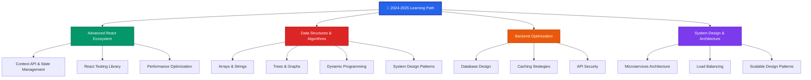

<div align="center">
  
</div>

<div align="center">
  
</div>

<div align="center">
  
  
  
  
</div>


##  Professional Overview


```typescript
interface DeveloperProfile {
  name: string;
  role: string;
  location: string;
  passions: string;
  specialization: string[];
  currentFocus: string[];
  careerGoal: string;
}

class MahdiMonir implements DeveloperProfile {
  name = "Moniruzzaman Mahdi";
  role = "Full Stack Developer";
  location = "Chattogram, Bangladesh";
  passions = ["Innovation", "Problem Solving", "Clean Code"];
  specialization = [
    "MERN Stack Development",
    "Next.js Applications",
    "Data Structures & Algorithms",
    "RESTful API Design",
  ];
  currentFocus = [
    "🚀 Advanced React Patterns",
    "📊 Data Structures & Algorithms",
    "⚡ TypeScript Mastery",
    "🔧 System Design Fundamentals",
  ];
  careerGoal = "Building impactful web solutions";

  getSkillMatrix() {
    return {
      frontend: { React: 85, NextJS: 80, JavaScript: 90, HTML_CSS: 95 },
      backend: { NodeJS: 85, ExpressJS: 85, APIs: 80, MongoDB: 85 },
      problemSolving: { DSA: 10, LeetCode: 5, SystemDesign: 10 },
      tools: { Git: 90, VSCode: 95, Postman: 85, Figma: 70 },
    };
  }

  getCurrentMission() {
    return "Transforming ideas into elegant, scalable web applications";
  }
}
```

<br clear="both">

## 💻 Technical Expertise

<div align="center">

### 🚀 **Core Stack** | MERN + Next.js

<div style="display: flex; justify-content: center; gap: 20px; margin: 20px 0;">
  <div style="text-align: center;">
    
  </div>
</div>

### 🎨 **Frontend Development**

<p>
  
  
  
  
  
  
</p>

### ☁️ **Backend & Database**

<p>
  
  
  
  
</p>

### 🧩 **Problem Solving & DSA**

<p>
  
  
  
  
</p>

### 🛠️ **Development Tools**

<p>
  
  
  
  
  
</p>

### 📚 **Currently Mastering**

<p>
  
  
  
  
</p>

</div>


## 📈 Performance Analytics

<div align="center">
  
  
</div>

<div align="center">
  
</div>

<div align="center">
  
</div>

## 🌟 Featured Projects Portfolio

<div align="center">
  <table>
    <tr>
      <td width="50%">
        <h3 align="center">🛒 E-Commerce Platform</h3>
        <div align="center">
          
          <br><br>
          
          
          
          
          <br>
          <sub><b>Full-stack e-commerce solution with payment gateway, admin dashboard, and inventory management</b></sub>
        </div>
      </td>
      <td width="50%">
        <h3 align="center">📋 Task Management System</h3>
        <div align="center">
          
          <br><br>
          
          
          
          <br>
          <sub><b>Modern task management with drag-and-drop, real-time updates, and team collaboration</b></sub>
        </div>
      </td>
    </tr>
    <tr>
      <td width="50%">
        <h3 align="center">💬 Real-time Chat Application</h3>
        <div align="center">
          
          <br><br>
          
          
          
          <br>
          <sub><b>Real-time messaging platform with JWT authentication, file sharing, and group chat features</b></sub>
        </div>
      </td>
      <td width="50%">
        <h3 align="center">🎬 Movie Discovery Platform</h3>
        <div align="center">
          
          <br><br>
          
          
          
          <br>
          <sub><b>Movie search and discovery platform with advanced filtering, watchlist, and recommendations</b></sub>
        </div>
      </td>
    </tr>
  </table>
</div>

##  Learning Roadmap & Development Goals

<div align="center">



</div>

<div align="center">
  <h3> Current Focus Areas</h3>
  <table>
    <tr>
      <td align="center" width="25%">
        
        <br><b>DSA Mastery</b>
        <br><sub>Solving 50+ problems/month on LeetCode</sub>
      </td>
      <td align="center" width="25%">
  
  <br><b>TypeScript</b>
  <br><sub>Building type-safe applications</sub>
</td>
<td align="center" width="25%">
  
  <br><b>System Design</b>
  <br><sub>Learning scalable architecture</sub>
</td>
      <td align="center" width="25%">
      
        <br><b>Open Source</b>
        <br><sub>Contributing to community projects</sub>
      </td>
    </tr>
  </table>
</div>

## 🏆 Achievements & Recognition

<div align="center">
  
</div>

<div align="center">
  <table>
    <tr>
      <td align="center" width="33%">
        
        <br><b>MERN Stack Certification</b>
        <br><sub>Comprehensive full-stack development</sub>
      </td>
      <td align="center" width="33%">
        
        <br><b>Next.js Specialization</b>
        <br><sub>Advanced React framework mastery</sub>
      </td>
      <td align="center" width="33%">
        
        <br><b>DSA Problem Solver</b>
        <br><sub>Active competitive programming</sub>
      </td>
    </tr>
  </table>
</div>

##  Professional Status & Opportunities

<div align="center">
  <table>
    <tr>
      <td align="center" width="20%">
        
        <br><b>Building</b>
        <br><sub>Production-ready applications</sub>
      </td>
      <td align="center" width="20%">
        
        <br><b>Learning</b>
        <br><sub>DSA & System Design</sub>
      </td>
      <td align="center" width="20%">
        
        <br><b>Seeking</b>
        <br><sub>Full-stack developer role</sub>
      </td>
      <td align="center" width="20%">
        
        <br><b>Open For</b>
        <br><sub>Remote collaborations</sub>
      </td>
      <td align="center" width="20%">
        
        <br><b>Contributing</b>
        <br><sub>Open source projects</sub>
      </td>
    </tr>
  </table>
</div>

##  Professional Network & Contact

<div align="center">
  <a href="https://www.linkedin.com/in/moniruzzaman-mahdi" target="_blank">
    
  </a>
  <a href="mailto:mahdimoniruzzaman@gmail.com" target="_blank">
    
  </a>
  <a href="https://x.com/Mahdimonir2004" target="_blank">
    
  </a>
  <a href="https://moniruzzaman-mahdi.vercel.app" target="_blank">
    
  </a>
  <a href="https://leetcode.com/mahdimonir" target="_blank">
    
  </a>
</div>

<div align="center">
  
</div>

## Daily Motivation

<div align="center">
  
</div>

## Contribution Activity

<div align="center">
  
</div>

<div align="center">
  
</div>

<div align="center">
  
</div>

---

<div align="center">
  <sub>⭐ From <a href="https://github.com/mahdimonir">MAHDI</a> • A passionate junior developer ready to make an impact</sub>
</div>
